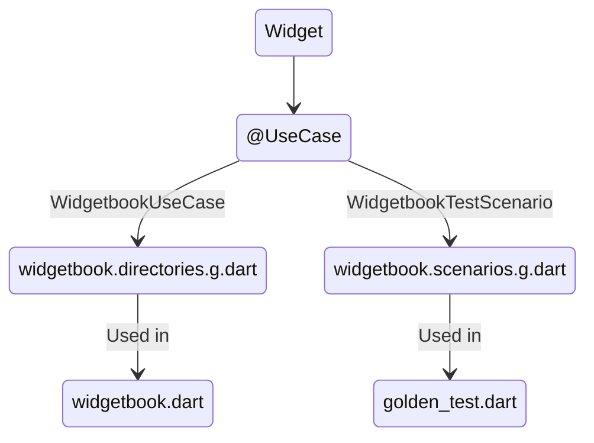

# Golden Testing with Widgetbook

This repo provides a very initial design of how should Golden Testing be supported in Widgetbook.
We currently discussing creating a new package called `widgetbook_test` that will provide the necessary
utilities and code generation to support Golden Testing.

> [!WARNING]
> The code in this repository is highly hypothetical, and **DOES NOT WORK**.  
> It is only meant to show the syntax and the outcome of code generation.

## Files

| File                                                                   | Description                                          |
| ---------------------------------------------------------------------- | ---------------------------------------------------- |
| [`foo_widget.dart`](./lib/foo_widget.dart)                             | The widget file                                      |
| [`foo_widget.usecase.dart`](./lib/foo_widget.usecase.dart)             | Contains functions annotated with `@UseCase(...)`    |
| [`widgetbook.scenarios.g.dart`](./test/widgetbook.scenarios.g.dart)    | `WidgetbookTestScenario` For each `@UseCase` element |
| [`golden_test.dart`](./test/golden_test.dart)                          | A normal golden test file using alchemist            |

## Flow

